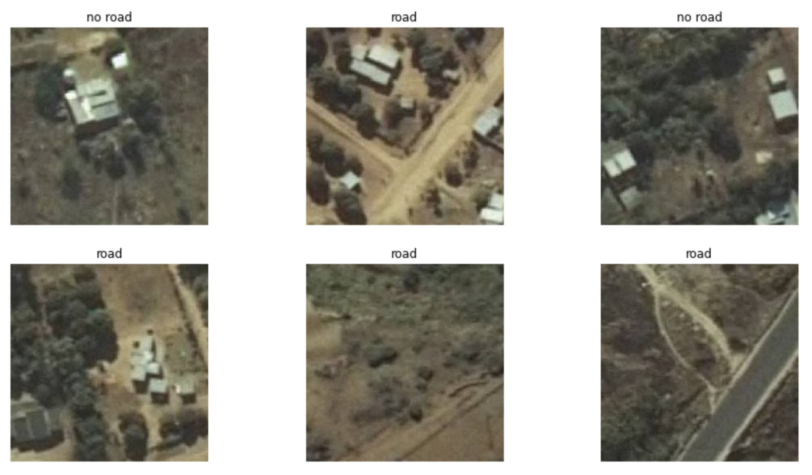

# Road Segment Identification Hackathon: 7th place solution

#### TASK - to identify whether an image contains a road segment or not.
#### Binary image classification:


- [Road Segment Identification Hackathon](https://zindi.africa/hackathons/road-segment-identification-challenge)


## Dataset

Download
[dataset](https://zindi.africa/hackathons/road-segment-identification-challenge/data)

## Solution:

Ensemble of 10 models:
* _resnet18_ and _efficientnet-b1_ each trained on 5 folds of train set 
* _geometric_ mean

## Environment:
```bash
git clone https://github.com/adeshkin/road_segment.git 
cd road_segment
python3 -m venv ./venv
source venv/bin/activate
pip install -r requirements.txt
```


## Training

```bash
python main.py default
```

## Submit 
auc score ~ 0.9677
```bash
python main.py ensemble_10x
```
